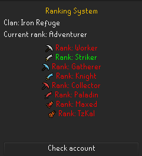

# Ranking System

### Currently in testing phase. Will allow other clans to use this plugin later.

## Features
- Let clan owners make their own custom ranks for their clan.
- Show current accessible rank in color inside the panel to make easier for rank up.
- Track items, combat achievement, collection log items, boss killcount, total level, base stats, prayers unlocked, diaries completed and more...

## How to use
1. Open your prayers if you have rigour / augury unlocked and turn them on / off.
2. Open your combat achievements, click on the menu on the top left, select tasks and make sure every filter is set to "All". If one filter wasn't, reopen them the same way.
3. Open your collection log and click on every single boss, raid, clue, mini-game, other. Otherwise, it will not be counted if the clan has those requirements.
4. Open your bank then you can click the button "Check account" which will show the current ranks for your clan and your eligibility.

## Why is there a warning when installing this plugin?
This is because the plugin automatically sends the name of your clan and your IP address to my website which are not stored anywhere to get the ranks that have been set by the owner of your clan.

## Things to add/do
- [x] Fix as many bugs as possible to make this smooth / Code review
- [ ] Add more things to the local storage. e.g: Prayers unlocked
- [ ] Let other clans use the plugin with their own custom ranks

[//]: # (- [ ] Discord notifications?)

More things to come :)

Feel free to suggest ideas for this plugin.
